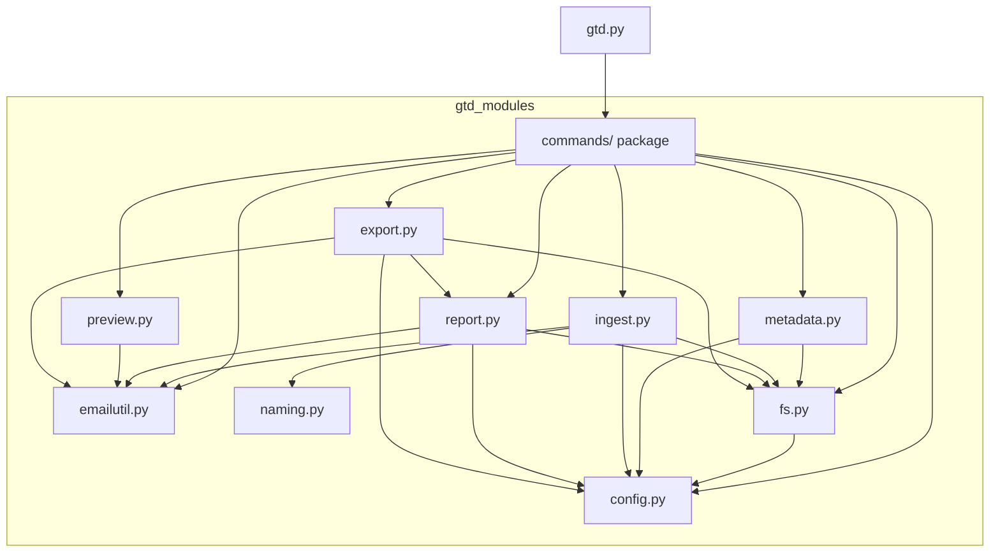

# GTD-over-EML — Maintainer's Guide

A small toolkit for running a [Getting Things Done](https://gettingthingsdone.com/)
workflow on top of plain `.eml` email files. This document is for whoever
(human or AI) needs to understand, extend, or debug the codebase next.

---

## 1. What the system does

You manually export emails as `.eml` files and drop them into an `01-input`
folder. The toolkit then:

1. **Ingests** each new file: reads its headers and body, derives a tidy
   filename from the date + subject (plus a detected *message ref*), and moves
   it into `02-triage`.
2. Lets **you** file each triaged email into `03-actionable`, `04-delegated`,
   `05-reference`, or `06-archive` — with `gtd.py alloc` or by hand.
3. **Reports** on what's sitting in each folder — colour-coded by age, showing
   correspondents, which of your own accounts received it, and the next action.
4. Keeps a **`metadata.csv`** at the working-directory root in sync with the
   files that currently exist, so you can annotate emails with notes, a project,
   and a next action.

The same `gtd.py` also **previews** a single email in a terminal- and
`glow`-friendly format (`gtd.py view`).

---

## 2. The single entry point

`gtd.py` is a thin **command dispatcher**. It takes a subcommand as its first
argument and forwards the rest to a handler in the `gtd_modules/commands/`
package (one module per command):

| Command | Purpose |
| --- | --- |
| `python3 gtd.py list [folder]` | Run the full workflow: ingest → sync metadata → print report. With a folder name/alias, print just that segment. |
| `python3 gtd.py export <format> [output-file]` | Export every tracked email (triage, actionable, delegated, reference, archive) to another data format. Currently one format: `masterdetail_yaml` (a single `.yml` conforming to the master-detail viewer SPEC). Read-only on the workflow (reconciles `metadata.csv`, no ingest/moves). |
| `python3 gtd.py search <text>` | Search the full report for a literal, case-insensitive string (joined from all words after `search`, `#`/`@` included) and print the matching entries with the matched text highlighted. Read-only: no ingest, no moves. |
| `python3 gtd.py stats` | Print each workflow folder and its `.eml` count, plus a total. |
| `python3 gtd.py view <file.eml>` | Print one email (headers, attachments, body). The `.eml` extension is optional. Pipe-friendly: `… \| less` or `… \| glow -`. |
| `python3 gtd.py alloc <file.eml> <dest>` | Find where an email is filed and move it to another folder. `dest` is an alias (`actionable`, `delegated`, `reference`, `archive`, `triage`, `input`) or a full folder name. |
| `python3 gtd.py close <file.eml> with <other.eml>` | Archive an email and record what closed it. Refuses if it is already in `06-archive`; otherwise moves it there and sets `next_action` to `Closed with <other.eml>`. The word `with` is optional; `<other.eml>` must itself exist in the workflow (errors with no changes otherwise). |
| `python3 gtd.py pin <file.eml>` / `unpin <file.eml>` | Add or remove the `pinned` token in the email's `flags` metadata field. |
| `python3 gtd.py metadata <file.eml> get/set <field> [=] [value]` | Read or write a `metadata.csv` field. Editable: `general_notes`, `project`, `next_action`, `flags`; `message_ref` is read-only. |
| `python3 gtd.py help` | Print the command overview. |

`gtd.py` is deliberately thin (~75 lines): it maps subcommand names to handlers
and does nothing else. All real logic lives in the `gtd_modules` package. It
must be launched from the directory that contains `gtd_modules/` and
`config.yml` (or with that directory on `PYTHONPATH`).

No-argument, `-h`/`--help`, and unknown-command invocations all print the help
text. Handlers return a process exit code (0 = success, 1 = not-found / runtime
error, 2 = usage error).

---

## 3. Folder layout on disk

The six workflow folders and `metadata.csv` live under the configured
`working_directory` (NOT necessarily next to the code):

```
<working_directory>/
    01-input/         # you drop new .eml files here
    02-triage/        # `list` moves renamed files here
    03-actionable/    # you file emails here (via `alloc` or by hand)
    04-delegated/     # you file emails here
    05-reference/     # you file emails here
    06-archive/       # you file emails here
    metadata.csv      # auto-created & kept in sync
```

The code itself is laid out as:

```
gtd.py                    # entry point: subcommand dispatcher
config.yml                # user settings (see §5)
gtd_modules/
    __init__.py           # package docstring only
    config.py             # settings, constants, colours, folder aliases, account normalisation
    commands/             # subcommand handlers, one module per command
        __init__.py       # re-exports every cmd_* handler + HELP_TEXT
        list.py           # cmd_list
        export.py         # cmd_export
        stats.py          # cmd_stats
        view.py           # cmd_view
        alloc.py          # cmd_alloc
        search.py         # cmd_search
        close.py          # cmd_close
        pin.py            # cmd_pin, cmd_unpin (+ shared _toggle_flag)
        metadata.py       # cmd_metadata
        help.py           # cmd_help (+ HELP_TEXT)
    emailutil.py          # SHARED email parsing (headers, body, base64/QP, refs)
    fs.py                 # folder creation, listing, locating + moving files
    naming.py             # filename-convention generation
    ingest.py             # rename + move 01-input → 02-triage
    metadata.py           # metadata.csv load/sync + per-field get/set
    report.py             # colour-coded status report + `search` over its entries
    export.py             # build + serialise the master-detail data export
    preview.py            # markdown-friendly single-message render
misc/
    _gtd                  # zsh (oh-my-zsh) Tab-completion for the `gtd` command
    shell_completion.md   # setup guide for the above
```

---

## 4. Module dependency graph

Arrows mean "imports / depends on". `gtd.py` dispatches into the `commands`
package, whose modules wire the feature modules together (the package
`__init__.py` re-exports each handler, so `commands.cmd_*` and
`commands.HELP_TEXT` still resolve from one import). `config.py`,
`emailutil.py`, and `naming.py` are leaf modules (no internal dependencies),
which makes them the safest to edit in isolation.



---

## 5. Configuration (`config.yml`)

Settings are read once at startup by `config.load_config()`. Any key omitted
falls back to `config.DEFAULTS`. PyYAML is required only if `config.yml` exists;
a missing library raises a clear error.

```yaml
working_directory: "/home/james/gtd-eml-data"   # where the 5 folders + metadata.csv live
max_filename_chars: 60        # cap on generated filenames (including ".eml")
archive_report_n: 10          # how many recent archive items to show
green_max_days: 2             # age < this  -> green
yellow_max_days: 14           # age < this  -> yellow ; otherwise red
max_subject_chars: 72         # subjects longer than this are truncated with "…"
force_colour: false           # true = always emit colour (e.g. when piping to `less -R`)
my_own_accounts:              # used to label/exclude your own addresses
  - email_address: james.smith@example.com
    display_name: "Work account"
    colour: yellow
  - email_address: james.personal@example.com
    display_name: "Personal account"
    colour: blue
```

`my_own_accounts` is normalised by `config.normalise_accounts()`: addresses are
lower-cased, a missing `display_name` defaults to the address, and an unknown
`colour` falls back to `cyan`. Valid colours are the keys of `config.COLOURS`
(`green`, `yellow`, `red`, `blue`, `magenta`, `cyan`).

---

## 6. How commands flow

`gtd.py` maps the first argument to a handler exported by the `commands`
package, then calls it. Each handler lives in its own module (e.g. `cmd_list`
in `commands/list.py`), but the package re-exports them all, so the dispatch
table in `gtd.py` keeps using `commands.cmd_list` and friends.

**`list [folder]`** (`commands.cmd_list`) — the full workflow:

1. `config.load_config()` → settings dict.
2. `fs.ensure_folders()` → creates any missing folders (and the
   `working_directory` itself).
3. `ingest.ingest_input_files()` → for each file in `01-input`: parse, build a
   name, ensure uniqueness, move into `02-triage`. Returns
   `(old_name, new_name, message_ref)` tuples.
4. `metadata.sync_metadata()` → rewrite `metadata.csv` to match the files that
   now exist; newly-ingested refs are seeded into the `message_ref` column.
5. `metadata.load_metadata()` then `report.print_report()` → the on-screen
   report.

Ingestion always runs (even when a folder is given). A `folder` argument is
resolved via `fs.resolve_folder()` and passed as `print_report(..., only=...)`,
which prints just that segment. A specifically-requested folder is shown in
full — the archive's `archive_report_n` cap applies only to the unfiltered
report.

**`stats`** (`commands.cmd_stats`) — `fs.ensure_folders()` then
`fs.list_eml_files()` per folder, printing each count and a total. Read-only;
does not ingest or modify anything.

**`export`** (`commands.cmd_export`) — selects a format from its `FORMATS`
table (currently only `masterdetail_yaml`), resolves the output path (default
`<working_directory>/export-masterdetail.yml`, or the given path with the
format's extension appended if missing), then `sync_metadata()` /
`load_metadata()` so annotations are current and `export.build_export()` to turn
every tracked email into a list of master-detail items. The items are built in
report order (triage → actionable → delegated → reference → archive; oldest →
newest within a folder) so an export mirrors `gtd list`. The format's `dump`
(`export.dump_masterdetail_yaml`) serialises them. Like `search` it is read-only
on the workflow — it reconciles `metadata.csv` but never ingests `01-input` or
moves anything. A bad/unreadable `.eml` is emitted as a placeholder item rather
than aborting the whole export. Adding a format is: write a `dump_*` in
`export.py` and register it in `FORMATS` (and the zsh `formats` array).

**`search`** (`commands.cmd_search`) — joins all words after `search` into one
query (so `gtd.py search project pudding` matches the literal `project pudding`,
not two separate words), then calls `report.search_report()`. That helper builds
each segment's entries with `report.build_folder_entries()` (the same block
builder `report_folder` prints), strips ANSI with `report.strip_ansi()`, and
keeps blocks whose lower-cased plain text contains the lower-cased query.
Because the match is a substring test on rendered text, `#` and `@` are just
ordinary characters and need no special handling. `search` reconciles
`metadata.csv` (`sync_metadata`) so flags/next_action are current, but unlike
`list` it does **not** ingest `01-input` or move anything. It searches the
archive in **full** — the `archive_report_n` display cap is deliberately not
applied, so a match is never hidden behind the cap. Each matching block is then
passed through `report.highlight_matches()`, which splices reverse-video markers
(`\033[7m` … `\033[27m`) around every occurrence of the query so it stands out.
Highlighting is applied only when colour is enabled, so piping to a plain file
still yields clean text.

**`view`** (`commands.cmd_view`) — `fs.find_eml()` to locate the file across all
folders, then `preview.render()`.

**`alloc`** (`commands.cmd_alloc`) — `fs.resolve_folder()` turns the destination
alias into a folder name, `fs.find_eml()` locates the file, and `fs.move_eml()`
relocates it. No-ops (already in the destination) and collisions are reported
without touching `metadata.csv` — metadata keys off the filename, which `alloc`
never changes, so no resync is needed.

**`close`** (`commands.cmd_close`) — parses `<file> [with] <other>` (the literal
`with` is optional), then `fs.find_eml()` locates the file. Next it
`fs.find_eml()`s `<other>` too: it **must** exist somewhere in the workflow, and
this check runs *before* anything is moved or written, so closing with a typo'd
or missing `<other>` exits 1 and leaves everything untouched. If the file being
closed is already in `06-archive` the command also refuses (exit 1). Only once
both files resolve does it `fs.move_eml()` the file into `06-archive` and call
`metadata.set_metadata_value()` to set `next_action` to `Closed with <other>`.
Both filenames may be given with or without the `.eml` extension (`find_eml`
appends it); the canonical on-disk name of `<other>` is what gets recorded.
Because `set_metadata_value` runs a full `sync_metadata` first, the just-moved
file is reconciled before its `next_action` is written.

**`pin` / `unpin`** (`commands.cmd_pin` / `cmd_unpin`, sharing
`commands._toggle_flag`) — `fs.find_eml()` locates the file, then
`metadata.add_flag()` / `metadata.remove_flag()` add or remove the `pinned`
token in the space-separated `flags` field. Both are idempotent: adding a flag
that is already present, or removing one that is absent, is reported as a no-op.
Flags are stored as space-separated tokens in the single `flags` column, so
these helpers split/rejoin rather than introducing a new column.

**`metadata`** (`commands.cmd_metadata`) — `fs.find_eml()` resolves the
canonical filename (extension optional), then `metadata.get_metadata_value()` /
`metadata.set_metadata_value()` read or write one field. A `set` first calls
`sync_metadata()` (reconciling the CSV with on-disk files) and then applies the
single edit, preserving all other fields. Editable fields are
`metadata.EDITABLE_FIELDS`; `message_ref` is readable but not editable (it must
stay in step with the filename suffix).

**`help`** (`commands.cmd_help`) — prints `commands.HELP_TEXT`.

### Colour output and paging

Whether colour is emitted is decided by `config.should_use_colour(cfg, stream)`,
with this precedence (highest first):

1. `NO_COLOR` env var set (to anything) → never colour (see https://no-color.org).
2. `FORCE_COLOR` env var truthy → always colour. Values `0`/`false`/`no`/`off`/
   empty do **not** force (see https://force-color.org).
3. `force_colour: true` in `config.yml` → always colour.
4. Otherwise → colour only when stdout is a TTY (`stream.isatty()`).

So by default piping to a file or pager produces clean text. To page **with**
colour and full scroll support (wheel, PgUp/PgDown, `/`-search):

```bash
FORCE_COLOR=1 python3 gtd.py list | less -R   # or set force_colour: true in config.yml
```

`less -R` passes ANSI colour through; without `-R` the codes show as literal
garbage. Add `-F` (skip pager for short output) and `-X` (don't clear on quit):
`less -RFX`.

**Multi-line colour gotcha:** pagers like `less` and many terminals reset SGR
colour state at every newline. A report entry is a multi-line block, so
`report.colourize()` re-applies the colour code at the **start of every line**
(and resets at the end of every line), not just once around the whole block. If
you ever "simplify" `colourize` back to a single leading code + trailing reset,
only the first line of each entry will be coloured under `less`. Don't.

---

## 7. Key behaviours & conventions (easy to break)

These are the non-obvious rules baked into the code. Preserve them when editing.

### Filenames (`naming.py`)
- Format: `yyyy-mm-dd-brief-description[-ref-<nanoid>].eml`.
- Only `[a-z0-9-]` in the description (via `slugify`).
- The whole name must fit within `max_filename_chars`. When a message ref is
  present, the **ref suffix is protected** and the subject slug is truncated to
  make room — never the ref.
- Collisions across *all five folders* are avoided by appending `-2`, `-3`, …

### Message refs (`emailutil.find_message_ref`)
- Pattern: `Message ref. <nanoid>` (case-insensitive, flexible spacing).
- The nanoid alphabet is `A-Za-z0-9_-`, length 6–32.
- In a reply thread with several refs, the **first** occurrence in the body
  wins (it's the current message's own ref).
- Refs are detected **only at ingestion** — never applied retroactively to
  files already in the system.

### metadata.csv (`metadata.py`)
- Columns: `eml_filename, general_notes, project, next_action, message_ref`.
- Sync is **non-destructive**: existing values are preserved, rows for
  vanished files are dropped, new files get blank (or ref-seeded) rows.
- Older CSVs missing newer columns are migrated automatically on next run.
- If you add a column, add it to `config.METADATA_HEADERS`; everything else
  keys off that list.

### Report rendering (`report.py`)
- Age colour (green/yellow/red) wraps only the **body block** (date/subject,
  filename, correspondents). The own-account label and the `└─ next:` line are
  emitted with their colour applied *separately* so they render distinctly — the
  account in its own configured colour, the next action uncoloured.
- The colour code is re-applied per line within a block (see the multi-line
  colour gotcha in §6) so it survives `less -R`.
- Correspondents exclude your own accounts and are capped at 3, with a
  `+ N more` line.
- The own-account label appears in **every** segment; `next_action` appears in
  triage/actionable/delegated/reference but **not** the archive.
- `04-delegated` is treated exactly like `03-actionable` (same report
  behaviour); it's just a separate filing destination.
- `report_folder` and `search` both build their per-email blocks via
  `build_folder_entries`, so a match found by `search` looks exactly like the
  same entry under `list`. `search` matches against `strip_ansi(block)`, so if
  you change how a block is rendered (new trailing line, different field), it
  becomes searchable automatically — but if you add colour/escape output that
  shouldn't be matched, make sure `strip_ansi` still removes it.
- `search`'s highlight (`highlight_matches` / `_highlight_line`) works on the
  already-coloured block: it walks each line into ANSI-code and literal-char
  tokens, finds matches in the plain text, and wraps them with reverse-video
  on/off codes (`\033[7m`/`\033[27m`). Reverse video (not a foreground colour)
  is used so the highlight survives over any underlying age/account/pinned
  colour and the specific `27m` reset leaves that colour intact. Matching is
  per line, mirroring the per-line colour model (a query can't highlight across
  a line break). Like all colour here it is gated on the colour-enabled flag,
  so plain piped output carries no escape codes.

### Preview (`preview.py`)
- Output is markdown-friendly: an H1 title, a blank line, a ```` ``` ```` fenced
  block of headers, then the body as plain markdown. This renders well in
  `glow` and reads fine in `less`.
- `gtd.py` swallows `BrokenPipeError` so quitting `less` early (or piping to
  `head`) doesn't dump a traceback — this covers `view` output too.

### Export (`export.py`)
- `masterdetail_yaml` targets the master-detail viewer SPEC
  (https://github.com/blairwang-online/qdvc-masterdetail-viewer/blob/main/SPEC.md).
  The document MUST be a top-level **sequence** of items, each a mapping with a
  reserved `title` field; we build one item per email.
- **Key/insertion order matters**: per SPEC §3.4, field order is YAML insertion
  order, so `build_item` inserts `title` first (it is the detail heading and
  must not be repeated) and the rest in reading order. Serialisation uses
  `yaml.safe_dump(..., sort_keys=False)` — do not re-enable key sorting.
- **No native temporal values** (SPEC §7.1): the email date is stringified to a
  plain ISO `YYYY-MM-DD` in `build_item`, so PyYAML never emits a native YAML
  date whose form could diverge across renderers. If you add a datetime field,
  stringify it the same way (ISO 8601, space between date and time).
- Empty metadata fields are omitted entirely (there are no required fields
  beyond `title`), keeping exports tidy.
- `01-input` is excluded: those files are not yet ingested/renamed, so they are
  not part of the tracked dataset `gtd list`/`export` cover.
- Items are ordered to mirror the report (triage → actionable → delegated →
  reference → archive; oldest → newest within a folder).
- Adding a format: write a `dump_<format>(items, out_path)` in `export.py` and
  register it in `commands/export.py`'s `FORMATS` (ext, default basename, dump),
  then add it to the zsh `formats` array.

### Shell completion (`misc/_gtd`)
The zsh completion script duplicates parts of the CLI surface, so it can drift
out of sync with the Python code. When you make a **user-facing CLI change**,
update `misc/_gtd` (and `misc/shell_completion.md` if the setup story changes)
to match:
- **Add/rename/remove a subcommand** → update the `subcommands` array in
  `_gtd` (name + description) and the examples in `shell_completion.md`.
- **Change a subcommand's argument shape** (e.g. a new positional, or new
  `get`/`set`-style verbs) → update that command's branch in the `_gtd` `case`
  statement so the right thing completes at each position.
- **Add/remove an editable metadata field** → update the `fields` array.
- **Add/rename a folder or its alias** → update the `destinations` array (these
  mirror `config.FOLDERS_BY_ALIAS`).
- **Change how `working_directory` is found** (config filename, or how `gtd.py`
  is located) → revisit `_gtd_working_directory`, which parses the `gtd`
  function/alias and reads `config.yml` to discover `.eml` files.

The completion is best-effort UX, not load-bearing: if it lags the code, the CLI
still works, you just lose a Tab suggestion. Still, keeping them in step is
cheap and worth doing in the same change.

---

## 8. Shared code

`emailutil.py` is the shared core used across commands. Anything touching raw
email structure — headers, address parsing, MIME walking, base64 /
quoted-printable decoding, HTML-to-text, ref detection — belongs here so the
`list`, `view`, and `alloc` paths never drift apart.

Note `get_email_body_text(message, render_html=False)`: the report/ingest path
(`list`) only needs raw text for scanning, while the preview (`view`) passes
`render_html=True` to get HTML converted to readable text. Keep that single
source of truth rather than reintroducing a second body extractor.

### Adding a new subcommand
Commands live one-per-module under `gtd_modules/commands/`. To add `foo`:
1. Create `gtd_modules/commands/foo.py` with a `cmd_foo(argv)` handler that
   returns an exit code (use an existing module as a template; import shared
   modules from the parent package, e.g. `from .. import fs`).
2. Re-export it from `gtd_modules/commands/__init__.py` (add the `from .foo
   import cmd_foo` line and list `cmd_foo` in `__all__`).
3. Register it in the `COMMANDS` dict in `gtd.py` (`"foo": commands.cmd_foo`).
4. Add a `foo` section to `HELP_TEXT` in `commands/help.py`, update this file
   and `README.md`, and update `misc/_gtd` (see §7) if the CLI surface changed.

Closely related commands can share a module (e.g. `pin.py` holds `cmd_pin`,
`cmd_unpin`, and their private `_toggle_flag` helper) — group by cohesion, not
strictly one command per file.

---

## 9. Testing changes quickly

There's no formal test suite. A fast manual smoke test:

```bash
# from a scratch dir containing gtd.py, gtd_modules/, config.yml
mkdir -p data/01-input          # point working_directory at ./data in config.yml
# drop a sample .eml into data/01-input, then:
python3 gtd.py list              # should ingest, write metadata.csv, print report
python3 gtd.py list delegated    # just the delegated segment
python3 gtd.py export masterdetail_yaml   # writes export-masterdetail.yml in working_directory
python3 gtd.py search pudding    # entries whose report text contains "pudding"
python3 gtd.py stats             # per-folder counts + total
python3 gtd.py view <the-new-filename>
python3 gtd.py alloc <the-new-filename> delegated   # should move it to 04-delegated
python3 gtd.py metadata <the-new-filename> set next_action = "Reply soon"
python3 gtd.py metadata <the-new-filename> get next_action   # -> Reply soon
python3 gtd.py pin <the-new-filename>     # adds "pinned" to flags
python3 gtd.py unpin <the-new-filename>   # removes it again
python3 gtd.py close <the-new-filename> with some-reply.eml   # archives + sets next_action
```

Useful checks when touching the relevant area:
- **Naming**: a very long subject + a ref, under a small `max_filename_chars`,
  should keep the full ref and truncate the subject.
- **Refs**: a base64 body and a multi-ref thread (first wins).
- **Colour**: run `FORCE_COLOR=1 python3 gtd.py list | cat -v` to see the ANSI
  codes. Each line of a report entry should begin with the same colour code
  (e.g. `^[[31m`) and end with `^[[0m` — not just the first line. Also confirm
  `NO_COLOR=1 python3 gtd.py list | cat -v` emits zero escape sequences.
- **alloc**: moving to a folder the file is already in should no-op; an
  unknown destination should exit 2; a missing file should exit 1.
- **search**: a multi-word query matches the literal phrase (not the words
  independently); upper/lower case is ignored; `#tag` and `addr@host` queries
  match those substrings; a query in only the archive still matches even past
  the `archive_report_n` cap; a no-match query prints a single "No emails…" line.
  With `FORCE_COLOR=1 … | cat -v` the matched text should be wrapped in
  `^[[7m`/`^[[27m`, the surrounding age/account colour should be preserved, and
  the plain (no-colour) run should contain no escape codes at all.
- **close**: closing an email not yet archived should move it to `06-archive`
  and set `next_action` to `Closed with <other.eml>`; closing one already in
  `06-archive` should exit 1 and change nothing; closing `with` a non-existent
  `<other.eml>` should exit 1 and leave the source file and its metadata
  untouched; the `with` keyword is optional.
- **pin/unpin**: `pin` then `pin` again should report the second as a no-op;
  `unpin` should drop only the `pinned` token, leaving any other flags intact.
- **metadata**: `set` then `get` should round-trip; setting a read-only field
  (`message_ref`) or unknown field should exit 2; other fields must be
  preserved across an edit.
- **Metadata migration**: hand-write an older CSV missing a column and confirm
  it gains the column with existing values intact.

To inspect the dependency graph programmatically:

```bash
for f in gtd.py gtd_modules/*.py; do
  echo "### $f"; grep -nE "^(from|import) .*gtd_modules|^from \. " "$f"
done
```

---

## 10. Dependencies

- **Python 3.8+** (uses f-strings, `email` stdlib, type-free code).
- **PyYAML** — needed if `config.yml` is present, and also by
  `gtd.py export masterdetail_yaml` (which serialises YAML) regardless of
  whether a `config.yml` exists. Install with `pip install pyyaml`. A missing
  library raises a clear error from whichever path needs it.
- No other third-party packages. The `email`, `csv`, `re`, `os`, and `datetime`
  modules are all standard library.

Optional external tools the output is designed to play nicely with: `less` and
[`glow`](https://github.com/charmbracelet/glow) for the `view` output.
