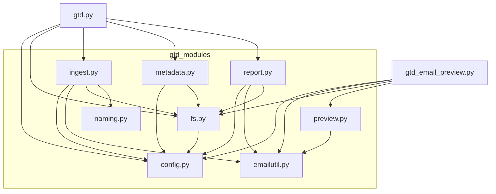

# GTD-over-EML — Maintainer's Guide

A small toolkit for running a [Getting Things Done](https://gettingthingsdone.com/)
workflow on top of plain `.eml` email files. This document is for whoever
(human or AI) needs to understand, extend, or debug the codebase next.

---

## 1. What the system does

You manually export emails as `.eml` files and drop them into an `01-input`
folder. The toolkit then:

1. **Ingests** each new file: reads its headers and body, derives a tidy
   filename from the date + subject (plus a detected *message ref*), and moves
   it into `02-triage`.
2. Leaves **you** to manually file each triaged email into `03-actionable`,
   `04-reference`, or `05-archive`.
3. **Reports** on what's sitting in each folder — colour-coded by age, showing
   correspondents, which of your own accounts received it, and the next action.
4. Keeps a **`metadata.csv`** at the working-directory root in sync with the
   files that currently exist, so you can annotate emails with notes, a project,
   and a next action.

A companion tool **previews** a single email in a terminal- and `glow`-friendly
format.

---

## 2. The two entry points

| Command | Purpose |
| --- | --- |
| `python gtd.py` | Run the full workflow: ingest → sync metadata → print report. Takes no arguments. |
| `python gtd_email_preview.py <filename.eml>` | Print one email (headers, attachments, body). The `.eml` extension is optional. Pipe-friendly: `… \| less` or `… \| glow -`. |

Both are deliberately thin (~60 lines). All real logic lives in the
`gtd_modules` package. They must be launched from the directory that contains
`gtd_modules/` and `config.yml` (or with that directory on `PYTHONPATH`).

---

## 3. Folder layout on disk

The five workflow folders and `metadata.csv` live under the configured
`working_directory` (NOT necessarily next to the code):

```
<working_directory>/
    01-input/         # you drop new .eml files here
    02-triage/        # script moves renamed files here
    03-actionable/    # you move files here
    04-reference/     # you move files here
    05-archive/       # you move files here
    metadata.csv      # auto-created & kept in sync
```

The code itself is laid out as:

```
gtd.py                    # entry point: full workflow
gtd_email_preview.py      # entry point: single-email preview
config.yml                # user settings (see §5)
gtd_modules/
    __init__.py           # package docstring only
    config.py             # settings, constants, colours, account normalisation
    emailutil.py          # SHARED email parsing (headers, body, base64/QP, refs)
    fs.py                 # folder creation, listing, locating files
    naming.py             # filename-convention generation
    ingest.py             # rename + move 01-input → 02-triage
    metadata.py           # metadata.csv load/sync
    report.py             # colour-coded status report
    preview.py            # markdown-friendly single-message render
```

---

## 4. Module dependency graph

Arrows mean "imports / depends on". `config.py`, `emailutil.py`, and
`naming.py` are leaf modules (no internal dependencies), which makes them the
safest to edit in isolation.



---

## 5. Configuration (`config.yml`)

Settings are read once at startup by `config.load_config()`. Any key omitted
falls back to `config.DEFAULTS`. PyYAML is required only if `config.yml` exists;
a missing library raises a clear error.

```yaml
working_directory: "/home/james/gtd-eml-data"   # where the 5 folders + metadata.csv live
max_filename_chars: 60        # cap on generated filenames (including ".eml")
archive_report_n: 10          # how many recent archive items to show
green_max_days: 2             # age < this  -> green
yellow_max_days: 14           # age < this  -> yellow ; otherwise red
max_subject_chars: 72         # subjects longer than this are truncated with "…"
force_colour: false           # true = always emit colour (e.g. when piping to `less -R`)
my_own_accounts:              # used to label/exclude your own addresses
  - email_address: james.smith@example.com
    display_name: "Work account"
    colour: yellow
  - email_address: james.personal@example.com
    display_name: "Personal account"
    colour: blue
```

`my_own_accounts` is normalised by `config.normalise_accounts()`: addresses are
lower-cased, a missing `display_name` defaults to the address, and an unknown
`colour` falls back to `cyan`. Valid colours are the keys of `config.COLOURS`
(`green`, `yellow`, `red`, `blue`, `magenta`, `cyan`).

---

## 6. How a run flows (`gtd.py`)

1. `config.load_config()` → settings dict.
2. `fs.ensure_folders()` → creates any missing folders (and the
   `working_directory` itself).
3. `ingest.ingest_input_files()` → for each file in `01-input`: parse, build a
   name, ensure uniqueness, move into `02-triage`. Returns
   `(old_name, new_name, message_ref)` tuples.
4. `metadata.sync_metadata()` → rewrite `metadata.csv` to match the files that
   now exist; newly-ingested refs are seeded into the `message_ref` column.
5. `metadata.load_metadata()` then `report.print_report()` → the on-screen
   report.

### Colour output and paging

Whether colour is emitted is decided by `config.should_use_colour(cfg, stream)`,
with this precedence (highest first):

1. `NO_COLOR` env var set (to anything) → never colour (see https://no-color.org).
2. `FORCE_COLOR` env var truthy → always colour. Values `0`/`false`/`no`/`off`/
   empty do **not** force (see https://force-color.org).
3. `force_colour: true` in `config.yml` → always colour.
4. Otherwise → colour only when stdout is a TTY (`stream.isatty()`).

So by default piping to a file or pager produces clean text. To page **with**
colour and full scroll support (wheel, PgUp/PgDown, `/`-search):

```bash
FORCE_COLOR=1 python gtd.py | less -R      # or set force_colour: true in config.yml
```

`less -R` passes ANSI colour through; without `-R` the codes show as literal
garbage. Add `-F` (skip pager for short output) and `-X` (don't clear on quit):
`less -RFX`.

**Multi-line colour gotcha:** pagers like `less` and many terminals reset SGR
colour state at every newline. A report entry is a multi-line block, so
`report.colourize()` re-applies the colour code at the **start of every line**
(and resets at the end of every line), not just once around the whole block. If
you ever "simplify" `colourize` back to a single leading code + trailing reset,
only the first line of each entry will be coloured under `less`. Don't.

---

## 7. Key behaviours & conventions (easy to break)

These are the non-obvious rules baked into the code. Preserve them when editing.

### Filenames (`naming.py`)
- Format: `yyyy-mm-dd-brief-description[-ref-<nanoid>].eml`.
- Only `[a-z0-9-]` in the description (via `slugify`).
- The whole name must fit within `max_filename_chars`. When a message ref is
  present, the **ref suffix is protected** and the subject slug is truncated to
  make room — never the ref.
- Collisions across *all five folders* are avoided by appending `-2`, `-3`, …

### Message refs (`emailutil.find_message_ref`)
- Pattern: `Message ref. <nanoid>` (case-insensitive, flexible spacing).
- The nanoid alphabet is `A-Za-z0-9_-`, length 6–32.
- In a reply thread with several refs, the **first** occurrence in the body
  wins (it's the current message's own ref).
- Refs are detected **only at ingestion** — never applied retroactively to
  files already in the system.

### metadata.csv (`metadata.py`)
- Columns: `eml_filename, general_notes, project, next_action, message_ref`.
- Sync is **non-destructive**: existing values are preserved, rows for
  vanished files are dropped, new files get blank (or ref-seeded) rows.
- Older CSVs missing newer columns are migrated automatically on next run.
- If you add a column, add it to `config.METADATA_HEADERS`; everything else
  keys off that list.

### Report rendering (`report.py`)
- Age colour (green/yellow/red) wraps only the **body block** (date/subject,
  filename, correspondents). The own-account label and the `└─ next:` line are
  emitted with their colour applied *separately* so they render distinctly — the
  account in its own configured colour, the next action uncoloured.
- The colour code is re-applied per line within a block (see the multi-line
  colour gotcha in §6) so it survives `less -R`.
- Correspondents exclude your own accounts and are capped at 3, with a
  `+ N more` line.
- The own-account label appears in **every** segment; `next_action` appears in
  triage/actionable/reference but **not** the archive.

### Preview (`preview.py`)
- Output is markdown-friendly: an H1 title, a blank line, a ```` ``` ```` fenced
  block of headers, then the body as plain markdown. This renders well in
  `glow` and reads fine in `less`.
- `gtd_email_preview.py` swallows `BrokenPipeError` so quitting `less` early (or
  piping to `head`) doesn't dump a traceback.

---

## 8. Shared vs. tool-specific code

`emailutil.py` is the shared core used by both entry points. Anything touching
raw email structure — headers, address parsing, MIME walking, base64 /
quoted-printable decoding, HTML-to-text, ref detection — belongs here so the two
tools never drift apart.

Note `get_email_body_text(message, render_html=False)`: the report/ingest path
only needs raw text for scanning, while the preview passes `render_html=True` to
get HTML converted to readable text. Keep that single source of truth rather
than reintroducing a second body extractor.

---

## 9. Testing changes quickly

There's no formal test suite. A fast manual smoke test:

```bash
# from a scratch dir containing gtd.py, gtd_email_preview.py, gtd_modules/, config.yml
mkdir -p data/01-input          # point working_directory at ./data in config.yml
# drop a sample .eml into data/01-input, then:
python gtd.py                   # should ingest, write metadata.csv, print report
python gtd_email_preview.py <the-new-filename>
```

Useful checks when touching the relevant area:
- **Naming**: a very long subject + a ref, under a small `max_filename_chars`,
  should keep the full ref and truncate the subject.
- **Refs**: a base64 body and a multi-ref thread (first wins).
- **Colour**: run `FORCE_COLOR=1 python gtd.py | cat -v` to see the ANSI codes.
  Each line of a report entry should begin with the same colour code (e.g.
  `^[[31m`) and end with `^[[0m` — not just the first line. Also confirm
  `NO_COLOR=1 python gtd.py | cat -v` emits zero escape sequences.
- **Metadata migration**: hand-write an older CSV missing a column and confirm
  it gains the column with existing values intact.

To inspect the dependency graph programmatically:

```bash
for f in gtd.py gtd_email_preview.py gtd_modules/*.py; do
  echo "### $f"; grep -nE "^(from|import) .*gtd_modules|^from \. " "$f"
done
```

---

## 10. Dependencies

- **Python 3.8+** (uses f-strings, `email` stdlib, type-free code).
- **PyYAML** — only needed if `config.yml` is present. Install with
  `pip install pyyaml`.
- No other third-party packages. The `email`, `csv`, `re`, `os`, and `datetime`
  modules are all standard library.

Optional external tools the output is designed to play nicely with: `less` and
[`glow`](https://github.com/charmbracelet/glow) for the preview.
